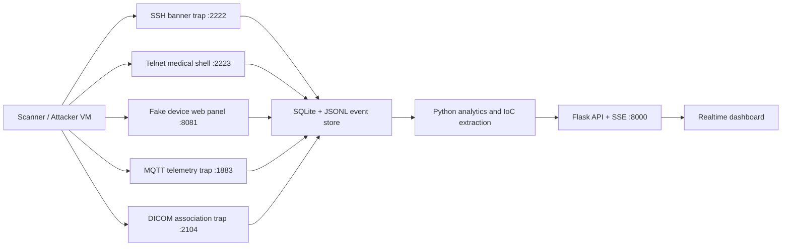

# Architecture

## Runtime View

## Components

| Component | Technology | Purpose |
| --- | --- | --- |
| Honeypot listeners | Python sockets and HTTP server | Simulate vulnerable healthcare IoT services without exposing a real shell |
| Dashboard API | Flask | Serve JSON endpoints, export data, and stream events with Server-Sent Events |
| Data store | SQLite and JSONL | Durable event storage for analysis and audit evidence |
| Frontend | HTML, CSS, JavaScript | Live threat dashboard for researchers and administrators |
| Containerization | Docker Compose | Isolated, repeatable lab deployment |

## Deception Profile

The default simulated asset is `MediVitals VX-1200`, a fictional patient vitals monitor located in `ICU-West-3`. It exposes common attacker magnets: old SSH banners, Telnet maintenance access, a weak web login panel, MQTT telemetry, and DICOM-like imaging traffic.

## Safety Boundary

The shell is fake. Commands are parsed, logged, and answered with static responses. URLs and upload attempts are saved as indicators, but no downloaded content is executed. The deployment should still be treated as hostile-facing infrastructure and placed in a segmented lab network.

